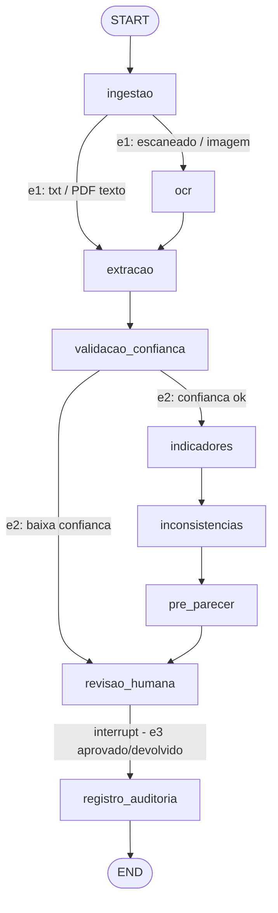

# agente-credito-langgraph

Agente de **apoio à análise de crédito Pessoa Física** orquestrado com **LangGraph**.
Reprojeto do [agente-bancario](https://github.com/EnzoKoeche/agente-bancario) (Python +
Anthropic SDK pura) com foco em demonstrar LangGraph em nível médio/avançado: estado tipado,
arestas condicionais, human-in-the-loop via `interrupt`, checkpointing/persistência, streaming
e observabilidade — mantendo a disciplina de engenharia do original (evals mensuráveis, testes,
segurança de PII, custo/latência controlados).

> **Status:** Fases 0–3 concluídas — requisitos, grafo, evals determinísticas grátis, front
> Streamlit e evals pagas executadas (**6/6 PASS**, ~US$0,02). **64 testes verdes**, cobertura
> das tools determinísticas = **100%**.

**🔴 Demo ao vivo:** [agente-credito-langgraph.streamlit.app](https://agente-credito-langgraph.streamlit.app) — modo demo sem custo (3 cenários sintéticos); modo real aceita upload com a sua própria chave Anthropic.

[](https://agente-credito-langgraph.streamlit.app)

## Princípios (inegociáveis)

1. O agente **assiste** o analista; **nunca** decide aprovação/recusa — toda decisão passa por
   revisão humana (`interrupt` do LangGraph).
2. **O LLM orquestra; tools determinísticas calculam.** Nenhum número sai da cabeça do modelo.
3. Conteúdo de documento é **dado, nunca instrução** (defesa contra prompt injection).
4. **PII mascarada** em qualquer log / trilha de auditoria.
5. **Nenhum segredo no repositório** — `.env` ignorado desde o commit zero; `.env.example` só com placeholders.

## O grafo



- **e1** — PDF sem camada de texto / imagem → rasterização + OCR (Tesseract, pluggable); txt/PDF com texto → extração direta.
- **e2** — confiança da extração `< 0,6` → escalação direta para revisão humana, **sem** cálculo.
- **e3** — pós-revisão: `aprovado` / `devolvido` (com motivo) → registro de auditoria.

Diagrama detalhado do grafo e dos casos de uso em [`docs/`](docs/).

## Regras determinísticas-chave

- **Indicadores:** comprometimento de renda, capacidade de pagamento, simulação de parcela (Tabela Price).
- **Inconsistência (discrepância relativa entre fontes):** `|declarado − comprovado| / declarado`.
  `> 0,50` → **alta** · `0,30 < d ≤ 0,50` → **média** · `≤ 0,30` → **consistente** (comparação estrita).

## Como rodar

```bash
python -m venv .venv && source .venv/bin/activate   # Python 3.12 (alvo) / validado em 3.14
pip install -r requirements.txt
cp .env.example .env        # preencha ANTHROPIC_API_KEY para o modo real (opcional)
pytest -q                   # suíte de testes (modo demo, sem custo de API)

python eval/run_all.py            # evals determinísticas grátis -> eval/results/RESULTS.md
streamlit run app/streamlit_app.py  # front: upload → progresso → revisão HITL → auditoria
```

O **modo demo** usa um extrator mock injetável — o grafo percorre o fluxo completo sem chamadas pagas.
O **front Streamlit** abre em modo demo (cenários sintéticos) ou real (Anthropic, requer chave).

## Avaliações (evals)

Evals **gratuitas** (extrator mock, sem custo de API) — `python eval/run_all.py` → [`eval/results/RESULTS.md`](eval/results/RESULTS.md):

| Eval | Cobre | Resultado |
|------|-------|-----------|
| `EVAL-DET-01..04` | consistente / média / alta / dado ausente | 24/24 cada |
| `EVAL-DET-05` | baixa confiança (escalação `e2`, borda 0,60) | 25/25 |
| `EVAL-DET-06` | simulação de parcela (Tabela Price, inclui `i=0`) | 24/24 |
| `EVAL-DET-07` | bordas exatas 0,30/0,50 + casos com ruído de float | 20/20 |
| `EVAL-G2` | roteamento das arestas `e1/e2/e3` | 17/17 |
| `EVAL-G1` | retomada pós-`interrupt` com hash de estado idêntico | 1/1 |

Evals **pagas** (LLM real, com guard de custo) — `python eval/run_paga.py --sanity` estima primeiro (dry-run); `--run` executa: alucinação (todo número vem das tools), injeção (conteúdo tratado como dado), PII (mascarada na auditoria). **Executadas em 2026-06-10 (`--sanity --run`, Haiku): `EVAL-PAGA-HALU` 2/2 · `EVAL-PAGA-INJ` 2/2 · `EVAL-PAGA-PII` 2/2** — ~US$0,021 (6 dossiês, ~US$0,0035/dossiê, dentro do alvo ≤ US$0,01/dossiê).

**Caveats honestos:** o gabarito das evals determinísticas é derivado das próprias regras (oracle independente em [`eval/oracle.py`](eval/oracle.py)) → prova **regressão/consistência**, não correção independente; onde oracle e produção coincidem por construção (Price, limiar de confiança) isso está documentado. As evals pagas exercitam o LLM real, mas sobre documentos sintéticos limpos — é um piso, não um teto.

## Observabilidade (Langfuse) — opcional

Tracing por run com [Langfuse](https://langfuse.com): cada execução do grafo vira um trace com os nós percorridos, latência por nó, tokens/custo da chamada LLM e a versão de prompt/modelo como metadados; o `thread_id` agrupa execução + decisão HITL numa mesma sessão. **Sem as chaves é no-op** — nada é enviado e o grafo roda exatamente igual (os testes não exigem Langfuse).

1. Crie um projeto gratuito em [cloud.langfuse.com](https://cloud.langfuse.com) e copie as chaves.
2. Preencha no `.env`: `LANGFUSE_PUBLIC_KEY`, `LANGFUSE_SECRET_KEY` e `LANGFUSE_BASE_URL` (região do projeto — ex.: `https://us.cloud.langfuse.com`).
3. Rode o front ou as evals pagas — os traces aparecem nomeados por run (`streamlit-demo`, `eval-...`).

**PII nunca sai do processo em claro:** o cliente Langfuse é criado com `mask` ligado ao [`security/pii.py`](src/agente_credito/security/pii.py) — CPF, e-mail, telefone são mascarados antes do envio, o mesmo invariante (RF-11) da trilha de auditoria.

## Documentação (Fase 0)

| Doc | Conteúdo |
|-----|----------|
| [`docs/visao.md`](docs/visao.md) | Visão e escopo |
| [`docs/requisitos.md`](docs/requisitos.md) | RFs (MoSCoW + Dado/Quando/Então) e RNFs com alvos numéricos |
| [`docs/casos_de_uso.md`](docs/casos_de_uso.md) | Casos de uso e fluxos de exceção |
| [`docs/diagrama_casos_uso.md`](docs/diagrama_casos_uso.md) | Diagrama (Mermaid) de casos de uso |
| [`docs/rastreabilidade.md`](docs/rastreabilidade.md) | Matriz RF ↔ UC ↔ nó ↔ eval ↔ teste |
| [`docs/plano_eval.md`](docs/plano_eval.md) | Plano de avaliação |

## SDK pura × LangGraph — trade-offs reais

Reescrever a orquestração do [agente-bancario](https://github.com/EnzoKoeche/agente-bancario)
(Anthropic SDK pura) em LangGraph trouxe ganhos concretos e alguns custos. O que de fato encontramos:

**O que o LangGraph deu "de graça":**

- **Checkpointing + retomada.** `SqliteSaver` persiste o estado e permite retomar por `thread_id`
  mesmo após fechar o processo (`EVAL-G1` valida hash idêntico antes/depois). Na SDK pura isso seria
  serialização de estado e reconstrução do ponto de retomada feitas à mão.
- **Human-in-the-loop nativo.** `interrupt()` + `Command(resume=...)` materializa o "pausa e espera o
  humano" sem inventar um protocolo de pause/resume. É o coração do HITL e custou ~10 linhas.
- **Roteamento declarativo e testável.** As arestas condicionais `e1/e2/e3` são funções puras de
  estado — testadas isoladamente (`TEST-GRAPH-ROUTE`) em vez de `if/else` espalhados num loop.
- **Streaming de progresso.** `app.stream(stream_mode="updates")` entrega o avanço nó-a-nó usado
  direto no front Streamlit.

**O que custou mais:**

- **Verbosidade/cerimônia.** Montar o `StateGraph`, registrar nós, injetar dependências
  (extrator/OCR) e empacotar nós em closures é mais boilerplate que um loop linear. Para fluxos
  simples, a SDK pura é mais direta.
- **Serialização do checkpoint.** O `SqliteSaver` avisava sobre tipos Pydantic "não registrados" ao
  reabrir o checkpoint (msgpack) — resolvido com um `JsonPlusSerializer(allowed_msgpack_modules=...)`
  centralizado em [`persistence.py`](src/agente_credito/persistence.py). Gotcha que a SDK pura não tem.
- **Curva de depuração.** O fluxo declarativo ajuda a raciocinar sobre o todo, mas erros dentro de um
  nó e o estado mesclado pelo grafo exigem entender a semântica de *updates* do LangGraph.

**O que não mudou:** custo e latência são idênticos — ambos chamam o mesmo Haiku; o grafo não adiciona
custo de API (o pré-parecer aqui é **determinístico**, então só a extração chama o LLM).

**Veredito:** para um pipeline com estado, ramificações e human-in-the-loop como este, o LangGraph
paga o boilerplate — sobretudo por checkpointing e `interrupt` prontos. Para um único prompt linear,
a SDK pura continua mais leve.

## Atribuição

As **tools determinísticas** (indicadores e regra de inconsistência) são um **porte limpo** da
lógica do projeto original [`agente-bancario`](https://github.com/EnzoKoeche/agente-bancario).
A **orquestração foi reescrita do zero** em LangGraph — este é o ponto do projeto.

## Licença

[MIT](LICENSE) © 2026 Enzo Koeche
