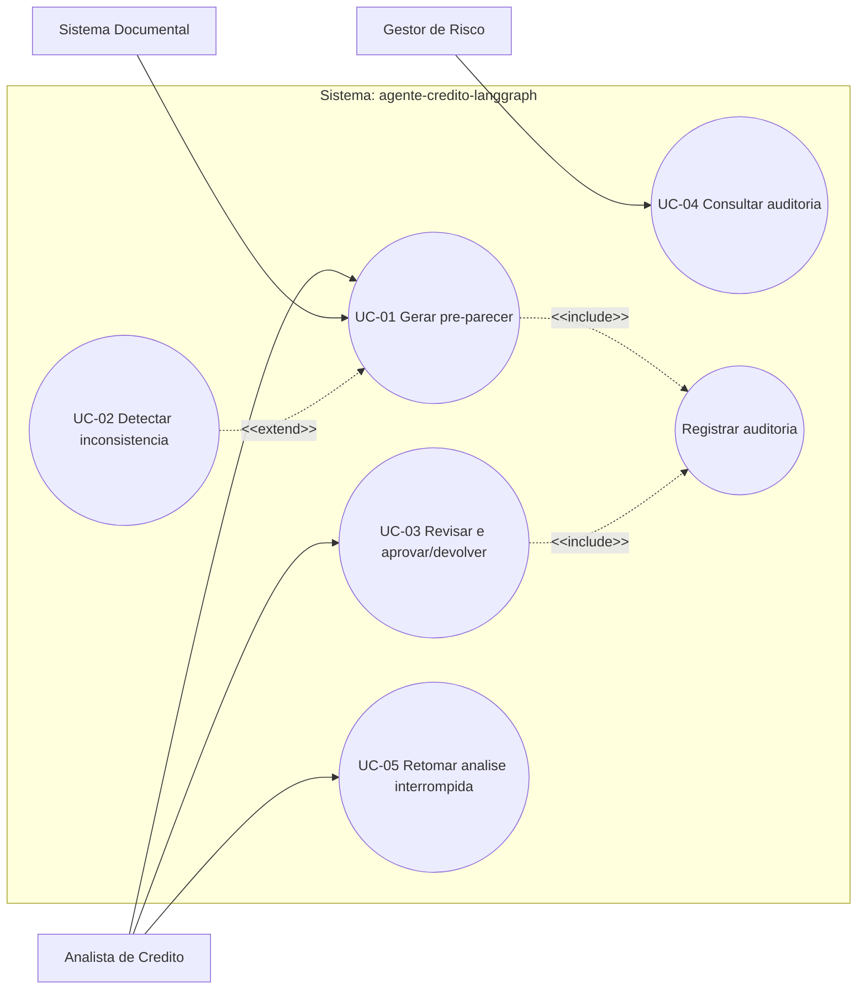

# Diagrama de Casos de Uso

Este documento apresenta o modelo de casos de uso do projeto **agente-credito-langgraph**, reprojeto em LangGraph do agente bancario, restrito ao escopo de **Credito Pessoa Fisica (PF)** — credito pessoal/consignado. O agente **assiste** o analista e **nunca** decide aprovacao ou recusa: toda decisao passa por revisao humana (HITL obrigatorio).

## Diagrama (Mermaid)



## Legenda

### Atores

| Ator | Tipo | Papel |
|------|------|-------|
| **A1 — Analista de Credito** | Primario | Submete o dossie, revisa o pre-parecer e aprova ou devolve a analise. E o consumidor direto do agente em UC-01, UC-03 e UC-05. |
| **A2 — Gestor de Risco** | Secundario | Consulta a trilha de auditoria (UC-04) e define limiares/politicas de risco. |
| **A3 — Sistema Documental** | Apoio (sistema externo) | Fornece os documentos do cliente (txt/PDF/imagem) que alimentam UC-01. |

### Casos de uso

| Caso de uso | Ator | Nos do grafo envolvidos |
|-------------|------|-------------------------|
| **UC-01 Gerar pre-parecer** (principal) | A1 — Analista de Credito; A3 — Sistema Documental (fornece documentos) | n1 ingestao, n2 extracao, n3 validacao_confianca, n4 indicadores, n5 inconsistencias, n6 pre_parecer (n1..n6) + n7 revisao_humana |
| **UC-02 Detectar inconsistencia** | A1 — Analista de Credito / A3 — Sistema Documental | n5 inconsistencias |
| **UC-03 Revisar e aprovar/devolver (HITL)** | A1 — Analista de Credito | n7 revisao_humana + n8 registro_auditoria |
| **UC-04 Consultar auditoria** | A2 — Gestor de Risco | n8 registro_auditoria (leitura) |
| **UC-05 Retomar analise interrompida** | A1 — Analista de Credito | Checkpointing (SqliteSaver por thread_id); retoma em n7 revisao_humana |
| **Registrar auditoria** | (caso incluido) | n8 registro_auditoria |

### Relacoes

- **`<<include>>` (inclusao obrigatoria):** o caso base sempre executa o caso incluido.
  - **UC-01 `<<include>>` Registrar auditoria** — gerar o pre-parecer sempre culmina no registro da trilha de auditoria (n8).
  - **UC-03 `<<include>>` Registrar auditoria** — revisar e aprovar/devolver tambem registra a decisao humana na auditoria (n8), com decisao=aprovado ou decisao=devolvido (e motivo).
  - O caso **Registrar auditoria** (mapeado ao no **n8 registro_auditoria**) e, portanto, compartilhado por UC-01 e UC-03.

- **`<<extend>>` (extensao opcional):** o caso estendido acrescenta comportamento ao caso base sob uma condicao.
  - **UC-02 `<<extend>>` UC-01** — a deteccao de inconsistencias (n5 inconsistencias) estende a geracao do pre-parecer quando ha discrepancia relativa entre fontes (RF-04: limiares 0,30/0,50, comparacao estrita). Quando nenhuma inconsistencia e relevante, o fluxo de UC-01 prossegue sem o comportamento adicional.

### Mapeamento UC -> nos do grafo (LangGraph StateGraph)

```
UC-01 -> n1 ingestao -> n2 extracao -> n3 validacao_confianca -> n4 indicadores -> n5 inconsistencias -> n6 pre_parecer -> n7 revisao_humana
UC-02 -> n5 inconsistencias            (EXTEND sobre UC-01)
UC-03 -> n7 revisao_humana + n8 registro_auditoria
UC-04 -> n8 registro_auditoria         (leitura)
UC-05 -> retomada por thread_id (checkpointing, RF-08); retoma em n7 revisao_humana
Registrar auditoria -> n8 registro_auditoria   (INCLUDE de UC-01 e UC-03)
```

> **Nota de emulacao:** por se tratar de um flowchart Mermaid emulando UML, os atores sao representados como nos retangulares (`A1`, `A2`, `A3`), os casos de uso como elipses (`(( ))`) e a fronteira do sistema como um `subgraph`. As associacoes ator-UC sao setas solidas sem rotulo; `<<include>>` e `<<extend>>` sao setas tracejadas rotuladas. Os sinais de menor/maior nos rotulos sao escritos como `&lt;` e `&gt;` para nao quebrar o parser do Mermaid.
